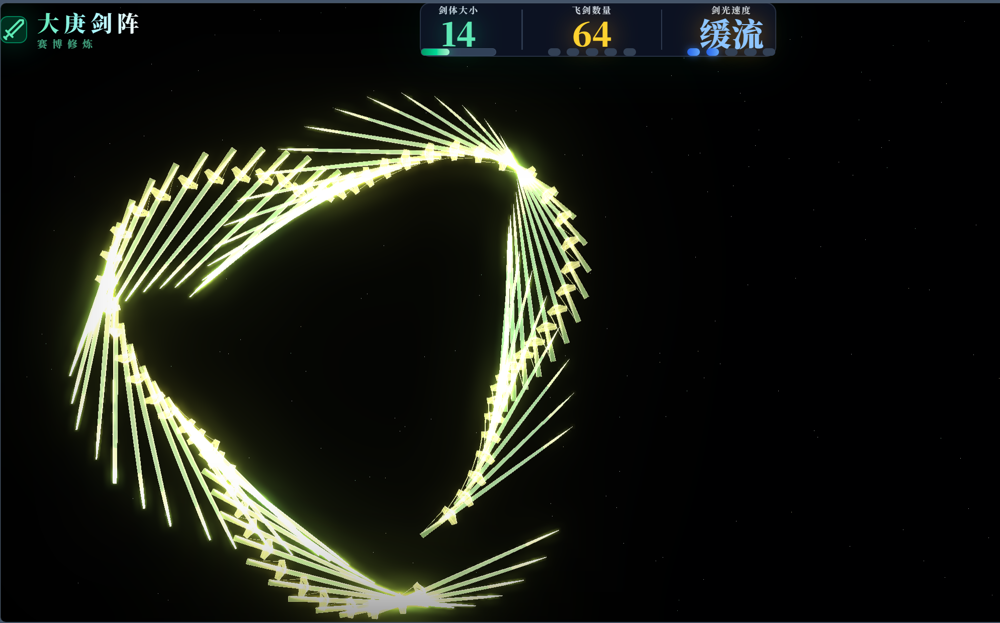
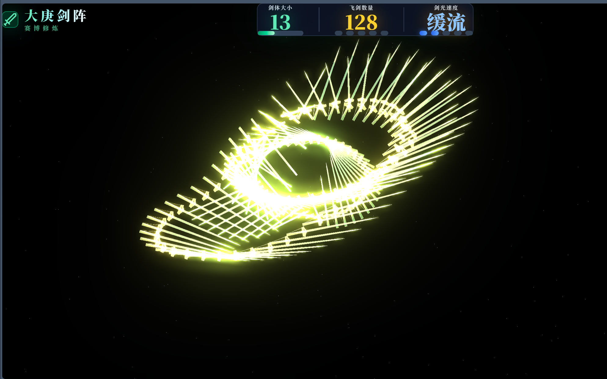
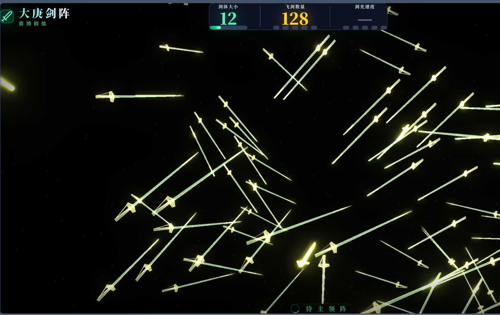
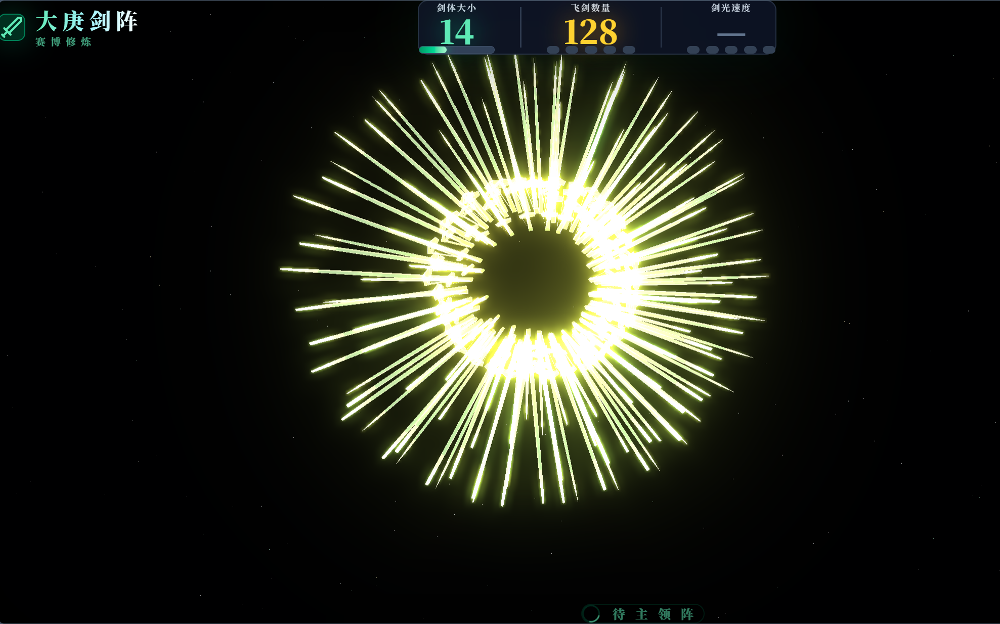
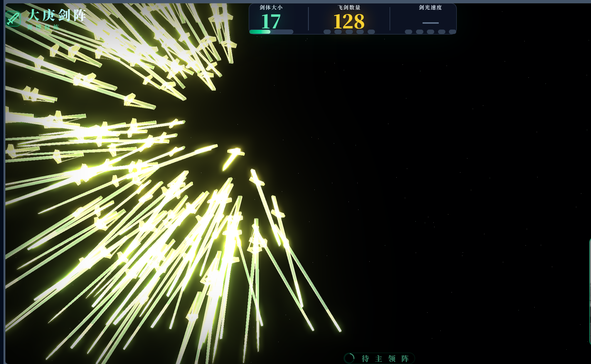
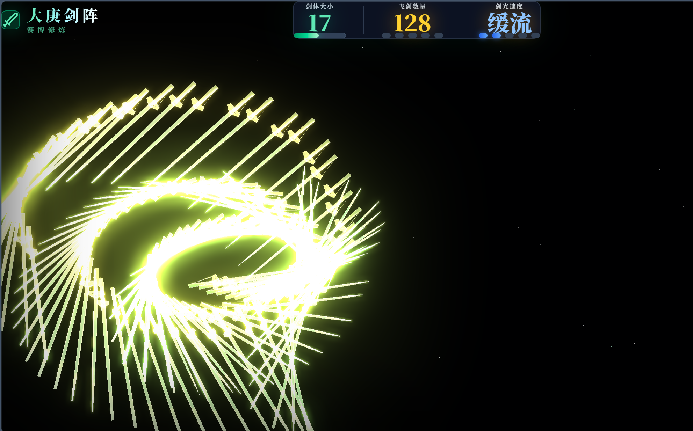
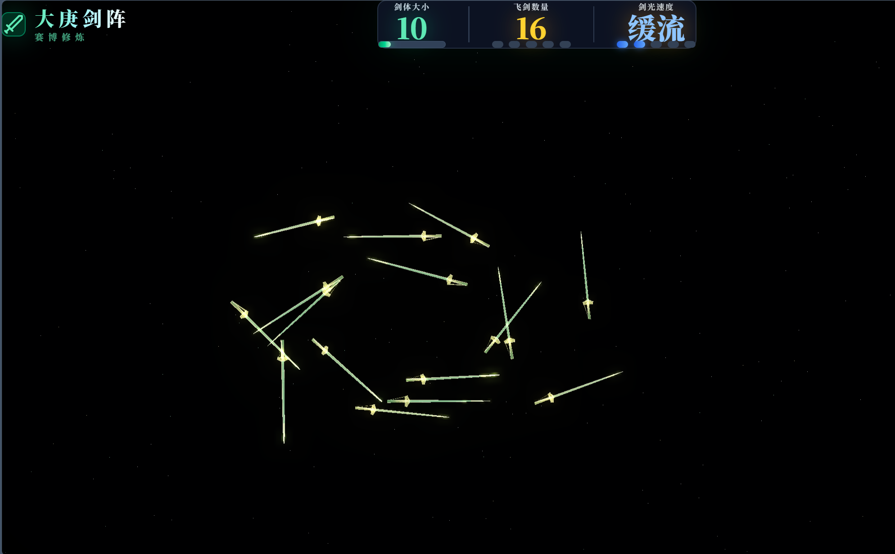
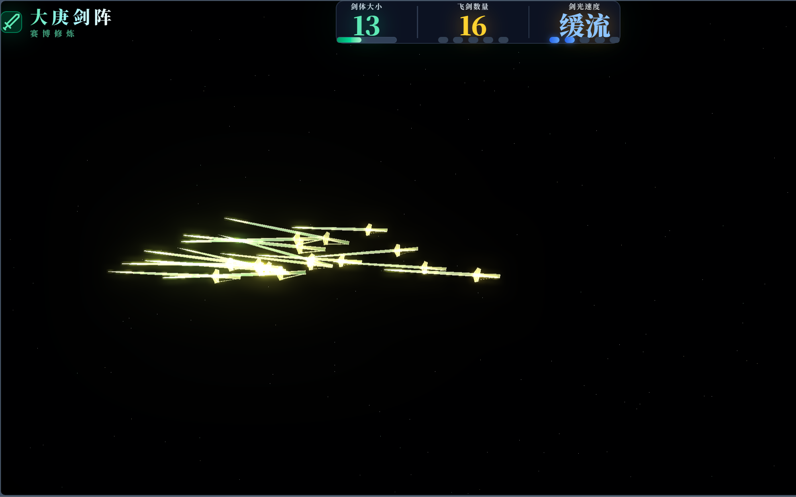

# 大庚剑阵 · 灵动篇 (Sword Array 3D)

<div align="center">

**凡人修仙传 · 韩立 · 大庚剑阵 | 手势操控 3D 飞剑模拟器**

[](https://react.dev)
[](https://threejs.org)
[](https://vitejs.dev)
[](https://ai.google.dev/edge/mediapipe)
[](https://ai.google.dev)

</div>

---

## 概述

**大庚剑阵 · 灵动篇** 是一款基于手势识别的沉浸式 3D 飞剑操控体验。通过摄像头捕捉双手动作，实时操控 8~200 把青竹蜂云剑在虚空中结成剑阵，完美还原《凡人修仙传》中韩立驱使大庚剑阵的体验。

内置 Gemini 3 Pro 驱动的 "韩立传音符" AI 对话系统，可与你畅谈修仙、剑阵、庚金之道。

---

## 截图预览

<div align="center">

| 剑阵效果 | 剑阵效果 |
|----------|----------|
|  |  |
|  |  |
|  |  |

| UI 界面 |
|---------|
|  |
|  |

</div>

---

## 手势操控

| 手 | 手势 | 控制参数 |
|---|------|----------|
| **右手** | 1 指 | 剑阵：**青元剑河**（点刺汇聚） |
| 右手 | 2 指 | 剑阵：**龙吟双流**（双龙并行） |
| 右手 | 3 指 | 剑阵：**三才螺旋**（三重螺旋） |
| 右手 | 4 指 | 剑阵：**庚金巨浪**（扇面冲击） |
| 右手 | 5 指 | 剑阵：**万剑随心**（群龙乱舞） |
| 右手 | 全掌展开 | 剑阵：**庚金盾幕**（圆盘防御） |
| 右手 | 握拳 | 剑阵：**剑丸归元**（护体绕行） |
| 右手 | 手部距离 | **剑光速度**（5 档：极缓→雷光） |
| 右手 | 手部位置 | **光标定位**（群剑追随） |
| **左手** | 1~5 指 | **飞剑数量**（8 / 16 / 32 / 64 / 128） |
| 左手 | 手部距离 | **剑体大小**（5~30 连续调节） |
| 左手 | 握拳 | **锁定**参数（冻结当前数值） |

无手势时，剑阵自动进入 **待主领阵** 状态，飞剑以群体行为算法（Boids Flocking）自由巡游。

---

## 视觉效果

### 3D 渲染
- **青竹蜂云剑**：自定义 GLSL 着色器，模拟竹节青玉剑身、金色雷弧纹理
- **竹节特效**：剑身每 3.5 单位一个竹节节点，节点处泛起金色环光
- **金雷闪电**：剑刃两侧生成动态金色电弧，随飞剑速度增强
- **菲涅尔辉光**：金色边缘光，配合 UnrealBloomPass 后处理产生辉光溢出
- **星域背景**：2000 粒子星空，含翡翠/金色星点，缓慢旋转
- **能量尾迹**：每把飞剑 3 个拖尾粒子，淡入淡出消散

### 物理模拟
- **PD 控制器**：飞剑以弹簧 - 阻尼系统追随目标，带预测补偿
- **龙形摆尾**：飞剑链沿运动方向形成正弦波浪，越靠尾端摆动幅度越大
- **Boids 集群**：空闲时 5 个分群各自执行分离 / 对齐 / 聚合行为
- **速度自适应摩擦**：飞剑越快阻尼越大，防止过冲振荡

---

## UI 界面

```
┌──────────────────────────────────────────────────────────────┐
│  🗡️ 大庚剑阵     │ 剑体大小 │ 飞剑数量 │ 剑光速度 │ 左手/右手 │ ▲ │
│   赛博修炼        │  20     │  72     │  中速   │ ● 待主领阵 │ ✕ │
│                   │ ████░░░ │ ●●●●○  │ ●●●○○  │            │   │
└──────────────────────────────────────────────────────────────┘
│                                                              │
│                    [3D 剑阵场景]                                │
│                                                              │
│         ┌──────────────┐                                     │
│         │ 摄像头预览    │                                     │
│         │ (右手画面)    │                                     │
│         └──────────────┘                                     │
│                          ◎ 待主领阵                             │
└──────────────────────────────────────────────────────────────┘
│                                    ┌─ 韩立传音符 ──────────┐ │
│                                    │ "道友请了..."         │ │
│                                    │  [AI 对话面板]        │ │
│                                    └──────────────────────┘ │
└──────────────────────────────────────────────────────────────┘
```

- **顶部栏**：标题 + 三大实时参数表（剑体大小 / 飞剑数量 / 剑光速度，均带进度条和指示灯）+ 左右手状态 + 当前剑阵名称（发光大字）
- **右下角**：半透明摄像头预览框（镜像、灰度、对比度增强），显示 MediaPipe 手势识别画面
- **底部中央**：旋转等待圈 + "待主领阵" 文字（无手势时显示）
- **右侧滑出**：Gemini 驱动的韩立 AI 对话面板，点击右上角 💬 图标打开

---

## 技术栈

| 层级 | 技术 |
|------|------|
| 框架 | React 19 + TypeScript |
| 3D 渲染 | Three.js 0.160 + InstancedMesh（200 实例） |
| 后处理 | EffectComposer + UnrealBloomPass |
| Shader | 自定义 GLSL 顶点/片元着色器 |
| 手势识别 | MediaPipe Hands（CDN 加载，无需后端） |
| AI 对话 | Google Gemini 3 Pro（韩立角色扮演） |
| 构建 | Vite 6 + Tailwind CSS 4 |
| 图标 | Lucide React |

---

## 安装部署

### 前置条件

- **Node.js** ≥ 18
- **摄像头**（用于手势识别）
- **Gemini API Key**（用于 AI 对话功能，可选）

### 本地运行

```bash
# 1. 克隆仓库
git clone https://github.com/HanGu007/sword-array-3d.git
cd sword-array-3d

# 2. 安装依赖
npm install

# 3. 配置 API Key（可选，不配也能看剑阵，只是不能用 AI 聊天）
echo "GEMINI_API_KEY=你的API密钥" > .env.local

# 4. 启动开发服务器
npm run dev
```

浏览器访问 `http://localhost:3000/`，首次打开会请求摄像头权限，允许后即可用手势操控。

### 生产构建

```bash
npm run build    # 输出到 dist/
npm run preview  # 本地预览构建产物
```

`dist/` 目录可部署到任意静态托管服务（Vercel / Netlify / GitHub Pages / CloudStudio）。

### 环境变量

| 变量 | 必填 | 说明 |
|------|------|------|
| `GEMINI_API_KEY` | 否 | Google Gemini API 密钥，用于韩立 AI 对话。缺失时聊天不可用，剑阵正常运行 |

---

## 项目结构

```
sword-array-3d/
├── App.tsx                    # 主应用：布局 + 状态管理
├── index.tsx                  # 入口
├── index.html                 # HTML 模板（加载 MediaPipe CDN）
├── index.css                  # Tailwind + 自定义样式
├── types.ts                   # TypeScript 类型定义
├── metadata.json              # AI Studio 元数据
├── vite.config.ts             # Vite 配置
├── tsconfig.json              # TypeScript 配置
├── components/
│   ├── SwordArray3D.tsx       # 3D 场景核心（Three.js InstancedMesh + GLSL Shader）
│   ├── HandTracker.tsx        # MediaPipe 手势识别 + 自适应距离标定
│   ├── CultivationChat.tsx    # 韩立 AI 对话面板
│   └── SwordArray.tsx         # (已废弃)
└── services/
    └── geminiService.ts       # Gemini API 封装（韩立角色扮演 System Prompt）
```

---

## License

MIT
